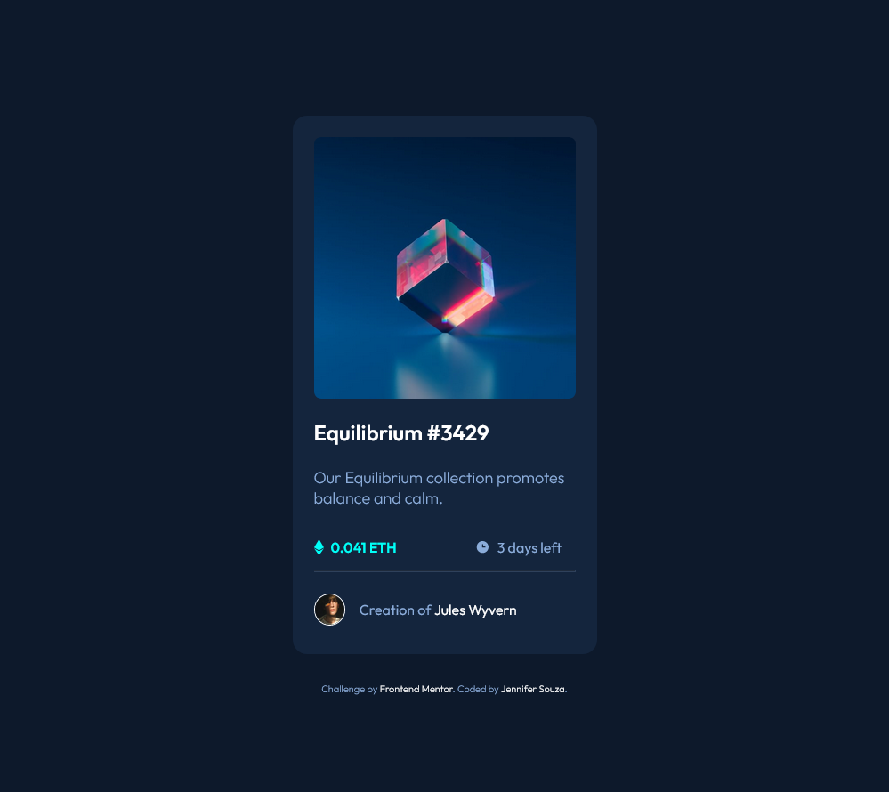

# Frontend Mentor - NFT preview card component solution

This is a solution to the [NFT preview card component challenge on Frontend Mentor](https://www.frontendmentor.io/challenges/nft-preview-card-component-SbdUL_w0U). Frontend Mentor challenges help you improve your coding skills by building realistic projects.

## Table of contents

- [Overview](#overview)
  - [The challenge](#the-challenge)
  - [Screenshot](#screenshot)
  - [Links](#links)
- [My process](#my-process)
  - [Built with](#built-with)
  - [What I learned](#what-i-learned)
  - [Continued development](#continued-development)
- [Author](#author)

## Overview

### The challenge

Users should be able to:

- View the optimal layout depending on their device's screen size
- See hover states for interactive elements

### Screenshot

### Links

- Solution URL: [https://github.com/zoedarkweather/nft-preview-card-component](https://github.com/zoedarkweather/nft-preview-card-component)
- Live Site URL: [https://nft-preview-card-component-lovat-theta.vercel.app/](https://nft-preview-card-component-lovat-theta.vercel.app/)

## My process

### Built with

- Semantic HTML5 markup
- CSS custom properties
- Flexbox
- Mobile-first workflow

### What I learned

I used this challenge as an opportunity to continue practicing css and accessibility. It was more challenging than I expected, especially the image-link hover state.

### Continued development

Continue practicing and learning.

## Author

- Github - [Jennifer Souza](https://github.com/zoedarkweather)
- Frontend Mentor - [@zoedarkweather](https://www.frontendmentor.io/profile/zoedarkweather)  
